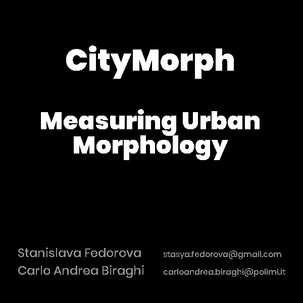

# CityMorph

Welcome to the CityMorph project! This is a framework intended for the calculation of urban metrics of a city zone.

<p align="center">
  
</p>

The framework evaluates an urban area based on a set of metrics. The building footprints represent *clusters* that grow in size using a defined increment value (1m) for a number of iterations. When two clusters intersect each other in this growth process, a unique cluster is formed from these two. The iterations continue until one unique cluster is formed.

Urban metrics that are currently supported:

* Number of clusters
* D-limit
* Total area of all the clusters
* Total perimeter of all the clusters
* Distance matrix - a table with the distances between all the clusters pair-wise
* Hindex - number of footprints in each cluster
* Area ratio - relationship between the area of a cluster and the convex hull around all the clusters
* Minimum cluster distance - the distance between the closest two clusters in the set
* Clusters at distance - number of clusters at distance of 5m
* Clusters at percent distance - number of clusters at percent of the initial D1 distance (distance required to cluster all the footprints into a unique cluster)

Metrics applied to a set of urban metrics obtained during *all the iterations* (e.g. number of clusters on iter1 = 6, iter2 = 3, iter3 = 3, iter4 = 1, so we use [6, 3, 3, 1]):

* XY - iteration at which the _number_ of iteration is equal to the value of a metric (e. g. in our example on iteration 3 we have 3 clusters, so the result is 3)
* Total sum - total sum of the values on all the iterations (e.g. in our example 6 + 3 + 3 + 1 = 13)
* Total NR Sum - total sum of all the _non repeating_ values on all the iterations (e.g. in our example 6 + 3 + 1 = 10)
* Max Variation - maximum difference between the values in two consequent iterations (e.g. in our example the differences are: 6-3=*3*, 3-3=0, 3-1=2; the largest is 3)
* Iter max variation - iteration on which the maximum difference between the values occurs (e.g. in our example the largest difference is 6-3=3 which is iteration *1*)
* Clusters Reduction Distance - metric that shows on which iteration the value reduces by more than 50%

## Installation

Clone this repo - download a zip file or type in command prompt```git clone https://github.com/STASYA00/CityMorph```

## Use

There are two ways of using the script. 

*Simple way* Place your shapefile in the folder ```test_shapefiles``` and rename all of them to be called ```test``` before the file extension. Double click on ```run.bat``` The program will install all the dependencies and run the evaluation on the shapefile.

*Slightly less simple way* open command prompt or terminal, navigate to the CityMorph folder. Then do:

```
pip install -r requirements.txt
python run.py PATH_TO_YOUR_SHAPEFILE.shp PATH_TO_YOUR_GRID_SHAPEFILE [--vis]
```
test example:
```
python run.py grid_test/A020102_Buildings_Units.shp grid_test/GRID_800-600_MI_COM.shp
```

--vis flag activates the visualization function, so that the images on all the iterations are stored to the ```vis``` folder.
in ```run.bat``` the visualization option is deactivated, to activate it edit ```run.bat``` or use the second way:)
